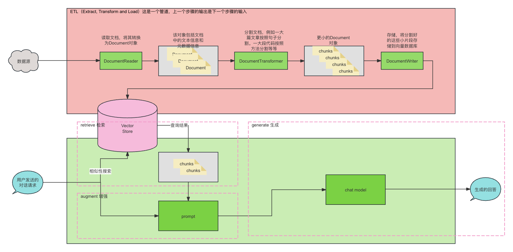
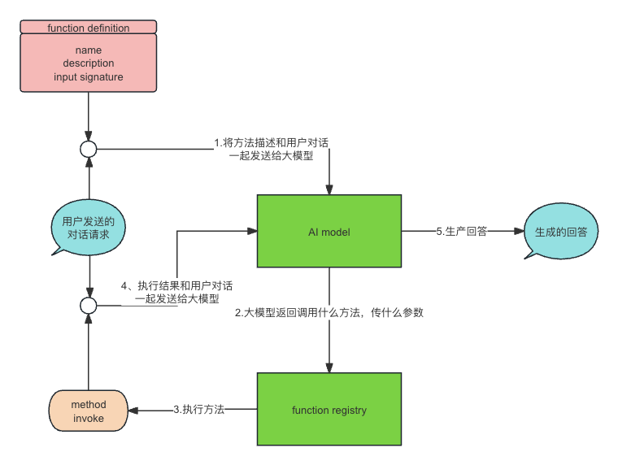

# spring ai学习笔记

## 概念速览

### model 

就是一个算法，给他一个自然语言的输入，他会给出自然语言、代码、音频、视频等输出。我们主讲自然语言模型（large language model，简称llm）

### Prompts 

就是给模型的输入。入门一点的理解就是，一个字符串。高阶一点的，告诉大模型扮演什么角色，给他几个用例，给他参考内容等等。研究怎么把大模型训练好很重要，研究怎么和大模型对话同样很重要，还有专门的学科：提示工程

### Prompt Templates

提示模板。就是字符串，里面有几个占位符。将占位符替换为你的值之后，就是prompts

### Embeddings

嵌入。这也是指一种算法。输入是文本，输出是向量（在java里表示为List\<Double\>）。向量就是人和模型之间交流的媒介。嵌入就是将人的语言转换为机器理解的语言。

### VectorStore

向量数据库。专注于存储和查询向量的系统，其向量源于文本、语音、图像等数据的向量化表示。

### Tokens

将大模型的输入输出分割成更小的单元。类似于编译原理里的词法解析。一个中文字差不多等于一个token，一个英文单词，差不多等于一个token。具体是多少，可以调用官方api进行计算。每个大模型输入就是有限制的，比如限制输入为4k、8k，也有一些支持长文本的，能够达到1M token。token就是钱，计费就是看消耗了多少token

### Structured Output

结构化输出。让大模型输出json或者xml等数据。当然，就算是让大模型输出json，他也是返回一个String，咱们拿着这个String反序列化就行。

### Function Calling

方法调用。让大模型拥有调用方法的能力，能够有效降低大模型的幻觉（不要让他胡说八道）

### Retrieval Augmented Generation（RAG）

检索增强生成。检索：从自己构建的知识库里查找。增强：查找出来的知识和用户的请求组合到一起。生成：让大模型生成回答。

### Agent

在 AI 大模型时代，任何具备独立思考能力并能与环境进行交互的实体，都可以被抽象地描述为智能体（Agent）。智能体构建在大语言模型的推理能力基础上，对大语言模型的 Planning 规划的方案使用工具执行（Action） ，并对执行的过程进行观测（Observation），保证任务的落地执行。

### 对比

| 要解决的问题   | 举例             | 人的思路 | 大模型的思路       |
| -------------- | ---------------- | -------- | ------------------ |
| 布置任务       | 查数据           | 对话     | Prompt Engineering |
| 新知识，记不住 | 公司内部员工手册 | 学习资料 | RAG                |
| 深度理解       | 学习新语言       | 学习     | Fine-tuning        |
| 对接外界       | 查询天气         | 查询工具 | Function Calling   |
| 解决复杂问题   | 工程项目         | 综合能力 | Agent              |

## 最速上手

### 初体验，源码解析

#### 准备工作

至少安装jdk17

创建springboot项目，starter里选择spring ai。你使用哪一个就勾选哪一个。

在application.yml文件里写上必要的配置。例如如果是使用别人的大模型，就需要配api-key。还有指定使用哪一个大模型。

#### 开始编码

只要是引入了对应的starter，配置文件里写了必要的配置，chatClient的bean就已经存在于spring容器中，直接注入进来调用call方法。

```java
@RestController
public class SimpleAiController {

	private final ChatClient chatClient;

	@Autowired
	public SimpleAiController(@Qualifier("azureOpenAiChatClient") ChatClient chatClient) {
		this.chatClient = chatClient;
	}

	@GetMapping("/ai/simple")
	public Map<String, String> generation(
			@RequestParam(value = "message", defaultValue = "ZBC，无情，哈拉少是什么意思") String message) {
    // 直接调用call方法就能开始对话
		return Map.of("generation", chatClient.call(message));
	}
}
```

要看spring ai框架给我们提供了什么能力，可以去看autoconfigure包。

org.springframework.boot.autoconfigure.AutoConfiguration.imports该文件是spring ai框架所支持的哪些第三方的大模型

我们选择使用azure。因为这个同样是提供的openai的接口，并且是在国内可以注册的。相对于chatgpt没那么麻烦。（如果是想使用本地部署的大模型，那么使用ollama）

那么我们只需要引入azure的starter就行了。然后就可以去看AzureOpenAiAutoConfiguration类里面，spring ai给我们提供了那些东西可以。（就是spring里的bean）

- OpenAIClient：azure的SDK，封装的各种http请求
- AzureOpenAiChatModel：实现了spring ai框架里的chatModel和StreamingChatModel。提供了基础对话功能和流式对话功能。继承了AbstractFunctionCallSupport，拥有方法调用的能力。组合了OpenAiClient（就是有个字段是OpenAIClient）
- AzureOpenAiEmbeddingModel：嵌入模型。提供嵌入功能
- FunctionCallbackContext：方法调用的上下文，就是可以理解为是方法的注册中心
- AzureOpenAiImageModel：AI作画的模型

下面开始正式使用

### 规范我们的输入，让大模型听懂我们的话

总结如下：（生成自AI）

> 写提示，指示清，
> 示例参考要带齐。
> 任务分拆步步来，
> 给点时间慢慢思。
>
> 外部工具来助力，
> 反复迭代问题析。
> 简明扼要巧安排，
> 模型聪明更给力。

#### PromptTemplate（提示模板）

在和大模型对话时，可以使用模版。

模版简单理解为，一个字符串，里面有占位符。

这样的话，主题是由我们写程序的人来定的，不会让大模型天马行空。对于用户来说，输入也是有限，能够更好的进行控制。

例如：

```st
有位音乐人叫{musician}，有首歌叫{songName}，帮我介绍一下这首歌的创作思路
```

```java
@RestController
public class PromptTemplateController {

	private final ChatClient chatClient;

	@Value("classpath:/prompts/prompt.st")
	private Resource resource;

	@Autowired
	public PromptTemplateController(ChatClient chatClient) {
		this.chatClient = chatClient;
	}

	@GetMapping("/ai/prompt")
	public ChatResponse completion(@RequestParam(value = "musician", defaultValue = "宇龙") String musician,
			@RequestParam(value = "songName", defaultValue = "我们去看海") String songName) {
    // 1、创建一个提示模版
		var promptTemplate = new PromptTemplate(resource);
    // 2、根据模版生成一个具体的提示
		var prompt = promptTemplate.create(Map.of("musician", musician, "songName", songName));
    // 3、调用
		return chatClient.call(prompt);
	}
}
```

#### Role（角色）

提示工程可是一门大学问，如何让大模型回答的更好，给他设置一个角色，让他知道他是谁。

```st
你是一个有用的AI助手。
你是原神游戏里旅行者的提瓦特大陆向导。
你的名字是{name}
你应该以{name}的名义和{voice}的风格回答用户的请求。
```

```java
@RestController
public class RoleController {

	private final ChatClient chatClient;

	@Value("classpath:/prompts/system-message.st")
	private Resource systemResource;

	@Autowired
	public RoleController(ChatClient chatClient) {
		this.chatClient = chatClient;
	}

	@GetMapping("/ai/roles")
	public ChatResponse generate(@RequestParam(value = "message",
			defaultValue = "从蒙徳到璃月怎么走") String message,
															 @RequestParam(value = "name", defaultValue = "派蒙") String name,
															 @RequestParam(value = "voice", defaultValue = "二次元美少女") String voice) {
		// 1、创建用户消息
    var userMessage = new UserMessage(message);
    // 2、创建系统消息模版
		var systemPromptTemplate = new SystemPromptTemplate(systemResource);
    // 3、根据系统消息模版生成具体的系统消息
		var systemMessage = systemPromptTemplate.createMessage(Map.of("name", name, "voice", voice));
    // 4、组合成一个prompt
		var prompt = new Prompt(List.of(userMessage, systemMessage));
    // 5、调用
		return chatClient.call(prompt);
	}
}
```

### 你的回合，让大模型输出我们想要的结果

#### outputParser（输出解析）

想让大模型更好的被我们所使用，只返回文本太局限了。让他直接返回给我们标准的json或者是map，或者直接映射到对象里。

第一种方法就是，使用提供的BeanOutputConverter，调用getFormat方法得到一串文本用于替换我们提示模版里的format。（其实就是很直白的告诉大模型，让他返回json格式，然后我们反序列化这个json）

```st
给我介绍一下手游三国杀里的武将：{sgsRoleName}
{format}
```

```java
public record SgsRoleCard(String name, Integer health, List<Skill> skills) {
}

record Skill(String name, String description) {
}
```

```java
@RestController
public class OutputParserController {

	private final ChatClient chatClient;

	@Value("classpath:/prompts/output-parser-message.st")
	private Resource resource;

	@Autowired
	public OutputParserController(ChatClient chatClient) {
		this.chatClient = chatClient;
	}

	@GetMapping("/ai/output")
	public SgsRoleCard generate(@RequestParam(value = "sgsRoleName", defaultValue = "界徐盛") String sgsRoleName) {
    // 1、创建一个输出解析器，这里选择解析为bean（还可以选择为list或者map）
		BeanOutputConverter<SgsRoleCard> outputConverter = new BeanOutputConverter<>(SgsRoleCard.class);
		// 2、创建一个模版，把解析器里的format也传进去
		var promptTemplate = new PromptTemplate(resource, Map.of("sgsRoleName", sgsRoleName, "format", outputConverter.getFormat()));
		// 3、创建具体的prompt
		var prompt = promptTemplate.create();
		// 4、调用call方法并进行解析
		return outputConverter.convert(chatModel.call(prompt).getResult().getOutput().getContent());
	}
}
```

第二种方法，使用spring ai框架提供的chatClient，不需要再创建解析器，也不用在模版里加上format。（虽然这个方法也是在底层创建解析器，但是不需要我们自己创建了）

```java
@GetMapping("/ai/output2")
public SgsRoleCard generate2(@RequestParam(value = "sgsRoleName", defaultValue = "界徐盛") String sgsRoleName) {
	return chatClient.prompt()
			.user(e -> e.text("给我介绍一下手游三国杀里的武将：{sgsRoleName}").param("sgsRoleName", sgsRoleName))
			.call()
			.entity(SgsRoleCard.class);
}
```

### 无知的你，让我为你灌输知识吧

大模型在他训练完成那一刻，就已经封存了。他所知道的所有知识都是那一个时间点之前的。当你询问他现在发生的一些事时，他要是回答不知道那还好，要是他硬是编造一些东西出来，对于真假还这不好分辨。有效的解决幻觉问题，可以使用微调技术。微调技术是要对大模型本身动刀子，需要算力资源，需要大量数据，需要时间，对于个人开发者来说基本不太现实。所以另辟蹊径，大模型不知道的东西，我们可以在问他的时候，直接传给他，他就知道了。

#### stuff（填充提示）

将数据合并到提示里，让大模型返回更加准确的并且与上下文相关的响应。

大模型训练的数据到某一时间就结束了，那么最新发布的小米su7，他肯定是一点都不了解的。

在我们和大模型的对话中加上小米su7的内容，那么他就能更准确的回答我们关于小米su7的信息。

```st
使用以下上下文，并且在最后回答问题。
如果你不知道答案，就说你不知道，不要当懂哥，不要试图编造答案。

{context}

问题: {question}
回答:
```

```java
@RestController
public class StuffController {

	private final ChatClient chatClient;

  // 这个文件就是随便网上找的一篇关于小米su7的文章
	@Value("classpath:/docs/misu7.md")
	private Resource docsToStuffResource;

	@Value("classpath:/prompts/qa-prompt.st")
	private Resource qaPromptResource;

	@Autowired
	public StuffController(ChatClient chatClient) {
		this.chatClient = chatClient;
	}

	@GetMapping("/ai/stuff")
	public ChatResponse completion(@RequestParam(value = "message",
			defaultValue = "小米公司发布的小米su7汽车有哪些颜色啊？") String message,
			@RequestParam(value = "stuffit", defaultValue = "false") boolean stuffit) {
    // 1、创建一个提示模版
		PromptTemplate promptTemplate = new PromptTemplate(qaPromptResource);
		Map<String, Object> map = new HashMap<>();
		map.put("question", message);
    // 2、stuffit表示是否在提示的时候加上小米su7的信息，方便测试的时候对比效果
		if (stuffit) {
			map.put("context", docsToStuffResource);
		}
		else {
			map.put("context", "");
		}
    // 3、创建具体的提示
		Prompt prompt = promptTemplate.create(map);
    // 4、调用call方法
		return chatClient.call(prompt);
	}
}
```

#### rag（检索增强生成）

一次性发那么多文字给大模型，那都是要钱的。咱们其实只需要发送一篇文章里最关键的那些句子发送给大模型就行了。

如何提取这些关键的信息。

- 从文档读取非结构化数据
  - DocumentReader：读取文档用的，支持PDF、Markdown、JSON等文件
- 转换
  - DocumentTransformer：处理数据用的，分割或者添加额外的元数据信息等等
  - Embedding：将数据转换为向量，在java里就是List\<Double\>，这个list数据就可以拿来和计算相似度
- 存入矢量数据库
  - DocumentWriter：保存数据的，一般是保存到向量数据库

之后再使用的时候，就使用 相似查找 的功能从矢量数据库里查，查出来的结果整合到咱们给大模型发的消息里，再一起发送给大模型。

```java
@RestController
@Slf4j
public class GIRagController {
  @Value("classpath:/data/GIRole.json")
  private Resource resource;

  @Value("classpath:/prompts/system-GI-role.st")
  private Resource systemGIRolePrompt;

  private final ChatClient chatClient;

  private final VectorStore vectorStore;

  public GIRagController(ChatClient chatClient, VectorStore vectorStore) {
    this.chatClient = chatClient;
    this.vectorStore = vectorStore;
  }

  @GetMapping("/ai/prepare")
  public void prepare() {
    // 1、读取文件
    JsonReader jsonReader = new JsonReader(resource, new GIRoleJsonMetadataGenerator(), "description");
    List<Document> documents = jsonReader.get();

    // 2、创建embedding并保存到向量数据库
    vectorStore.add(documents);
  }

  @GetMapping("/ai/GIRag")
  public ChatResponse generate(
      @RequestParam(value = "message", defaultValue = "璃月角色有哪些？简单给我介绍一下吧！") String message,
      @RequestParam(value = "weapon", defaultValue = "弓") String weapon,
      @RequestParam(value = "similarityThreshold", defaultValue = "0.0") double similarityThreshold,
      @RequestParam(value = "topK", defaultValue = "4") int topK) {
    // 3、检索相关文档
    List<Document> similarDocuments = vectorStore.similaritySearch(
        SearchRequest.query(message).withSimilarityThreshold(similarityThreshold).withTopK(topK).withFilterExpression(String.format("weapon == '%s'", weapon)));
    log.info("Found {} relevant documents.", similarDocuments.size());

    // 4、返回结果
    return chatClient.prompt().user(userSpec -> userSpec.text(message))
        .system(systemSpec -> systemSpec.text(systemGIRolePrompt, StandardCharsets.UTF_8)
            .param("documents", similarDocuments.stream().map(Document::getContent).collect(Collectors.joining("\n"))))
        .call().chatResponse();
  }
}
```

其中一些关键的解释。元数据信息：可以理解为这段文本的字段。比如有一段文本描述了某个人，那个元数据信息可以有这个人的姓名，性别，身高等。再进行相似性查找时。可以像写sql语句（例如：性别 = ‘男’）一样先筛选一些出来，再做相似性查找。

相似性查找：所有的文本都被转换成了向量（在java里就是List\<Double\>），相似性查找就是判断两个向量的相似性。

- 余弦相似性：向量夹角如何

  - $$
    \text{cosine similarity}(A, B) = \frac{A \cdot B}{\|A\| \|B\|}
    $$

    

- 杰卡德相似性：两个集合的重合度如何

  - $$
    \text{Jaccard similarity}(A, B) = \frac{|A \cap B|}{|A \cup B|}
    $$

    

- 欧几里德距离：两个点的直线距离，p，q是两个n维向量

  - $$
    d(p, q) = \sqrt{\sum_{i=1}^{n} (p_i - q_i)^2}
    $$

    

- 曼哈顿距离：两个点的距离，p，q是两个n维向量

  - $$
    d(p, q) = \sum_{i=1}^{n} |p_i - q_i|  
    $$

- 切比雪夫距离、闵可夫斯基距离、汉明距离、马氏距离等等

在自然语言处理（NLP）这个领域基本上都是使用的是余弦相似性



#### function calling（方法调用）

方法调用。让大模型拥有调用方法的能力，能够有效降低大模型的幻觉（不要让他胡说八道）。其实就是调用两次大模型，第一次，告诉他咱们这有哪些方法是可以调用的，传参是什么样的。然后和用户的输入一起发给大模型。大模型返回给我们，调用哪一个方法，参数是什么。然后我们自己执行方法，得到结果。第二次，将结果作为参考内容和用户的输入一起发给大模型。

先写自己要提供的方法

```java
@Slf4j
public class CalculateService implements Function<CalculateService.Request, String>{
  @JsonClassDescription("要进行计算的两个数")
  public record Request(BigDecimal a, BigDecimal b) {}

  @Override
  public String apply(Request request) {
    log.info("成功调用计算服务，参数为：{}", request);
    BigDecimal add = request.a.multiply(request.a).add(request.b.multiply(request.b));
    return add.toString();
  }
}
```

然后@Bean交给spring容器

```java
@Configuration
public class FunctionCallingConfig {
  @Bean
  @Description("计算两个数的平方和") // function description
  public Function<CalculateService.Request, String> calculate() {
    return new CalculateService();
  }
}
```

最后在使用的时候加上方法调用就行

```java
@RestController
public class FunctionCallingController {

  private final ChatModel chatModel;

  private final ChatClient chatClient;

  @Autowired
  public FunctionCallingController(@Qualifier("azureOpenAiChatModel") ChatModel ChatModel, ChatClient chatClient) {
    this.chatModel = ChatModel;
    this.chatClient = chatClient;
  }

  @GetMapping("/ai/functionCalling")
  public Map<String, ChatResponse> generation(
      @RequestParam(value = "message", defaultValue = "帮我计算45和67的平方和") String message) {
    return Map.of("generation", chatClient.prompt().user(message).functions("calculate").call().chatResponse());
  }
}
```


